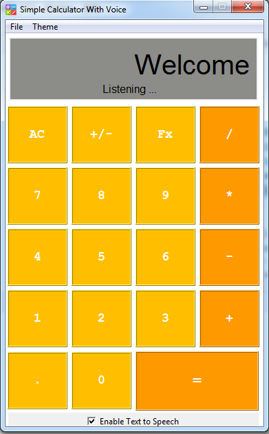
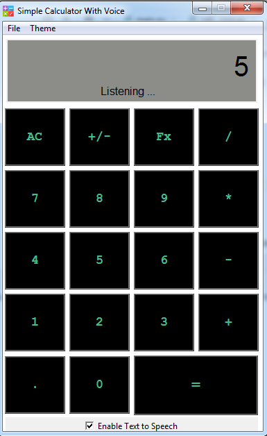
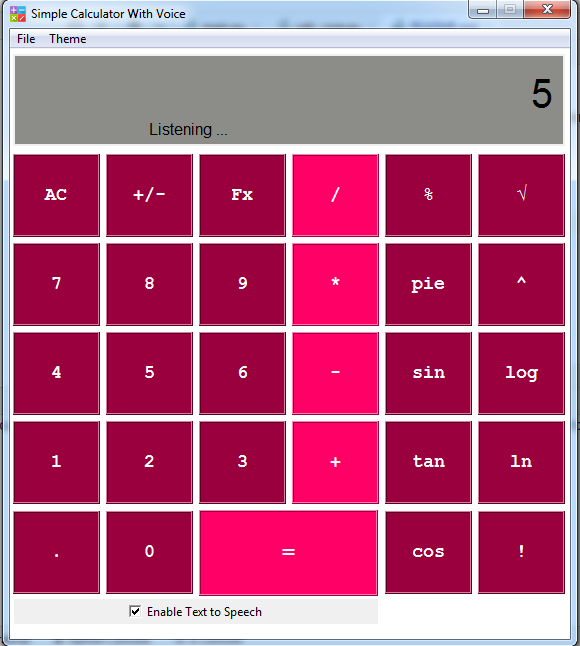

# Simple Calculator with voice

This is a my first Python GUI program. when i plan to create a program i think i want some thing different. so i added voice support to this program, it may help some one who suffered vision disability.

Image:

 
 
 


## Key Features

* Voice recognition
* Speech Support.
* Can Enable and Disable TTS.
* Can use keyboard instead use.
* Change Theme (High Contrast Theme Available)
* Build in Help file

## Installation

This Program require pyttsx3 library to enable voice.

```bash
pip install pyttsx3
```

This Program require speech_recognition library to enable voice.

```bash
pip install speech_recognition
```

## Additional Requirement

if you get error when use pyttsx3 may need some additional components. so please install pypiwin32 also

```bash
pip install pypiwin32
```

if you get error when use speech_recognition may need some additional components. so please install py_audio also

```bash
python -m pip install PyAudio
```

## Contributing
The program on initial stage, We try to implement more features.
Pull requests are welcome. For major changes, please open an issue first to discuss what you would like to change.

Please make sure to update tests as appropriate.

##Usage Guide

    +----------------------------------+
    |       Basic key definition       |
    +----------------------------------+

  
  |  Sign  |         Definition           |
| ------ | ------ |
  |   %    |         Percentage           |
  |   v    |         square root          |
  |  pie   |             pie              |
  |   ^    |       exponentiation         |
  |  log   |          logarithm           |
  |  ln    |       natural logarithm      |
  |  tan   |             tan              |
  |  sin   |             sin              |
  |  cos   |             cos              |
  |   !    |          factorial           |
  |   Fx   |                              |
  |   +    |            add               |
  |   -    |           subtract           |
  |   *    |         multiplied by        |
  |   /    |            divided           |
  |   =    |              equal           |

## Supported Voice Commands 
######   Note : Program Find Specifed Command in your word eg :- if you said "addition" program detect "add" then excute addition fuction 
   
 |Command | Definition|
 | ------ | ------ |
 | Calculator  |      Start Voice Command     |
 |    Quit     |      Quit Voice Command      |
 |    Clear    |        Clear Screen          |
 |     add     |         addition             |
 |     sub     |        Substration           | |    multi    |         multiple             |
 |      div    |          divide              |
 |    Equal    |          equal               |

                FAQ:-

Q1. How to start Voice Command?
A.  To Start Voice Command Just say "Calculator"
     then say first Argument then Operation Then
     Second Argument


         Will be Update Soon .....